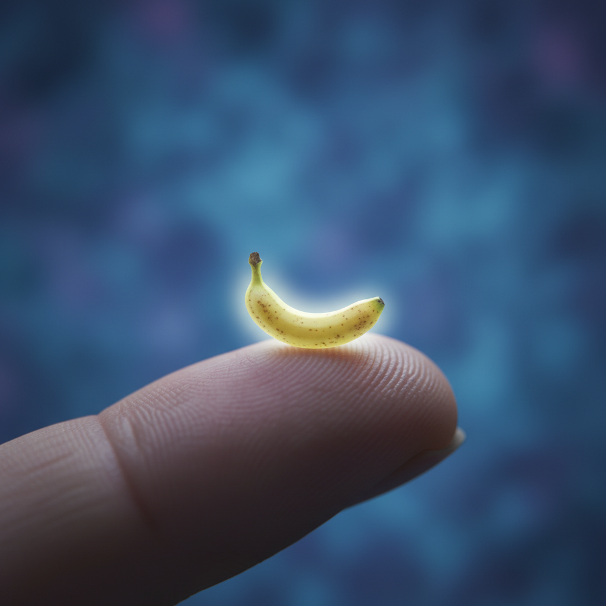
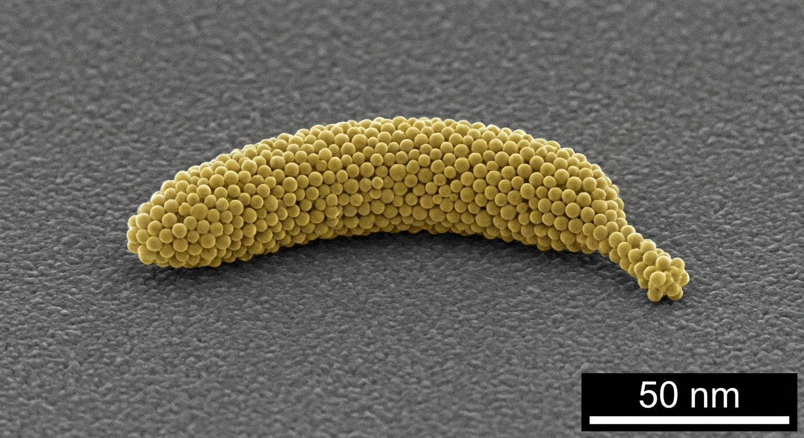
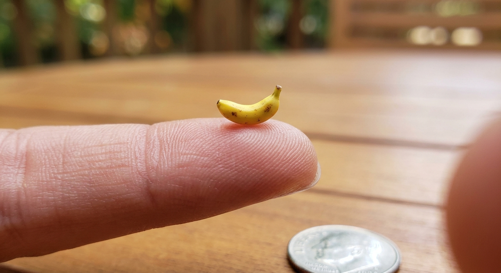
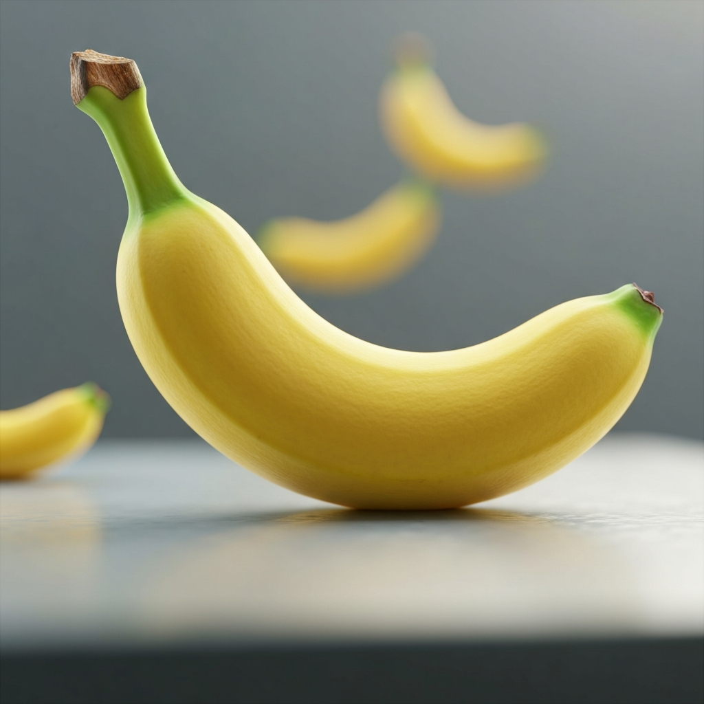
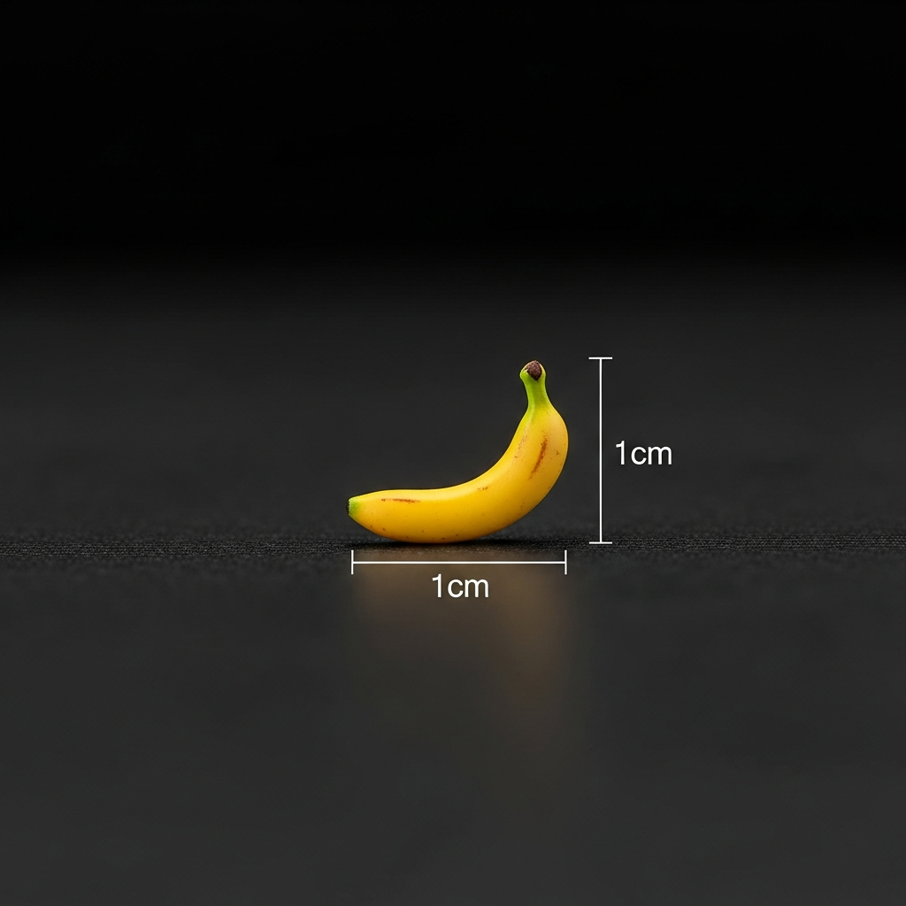
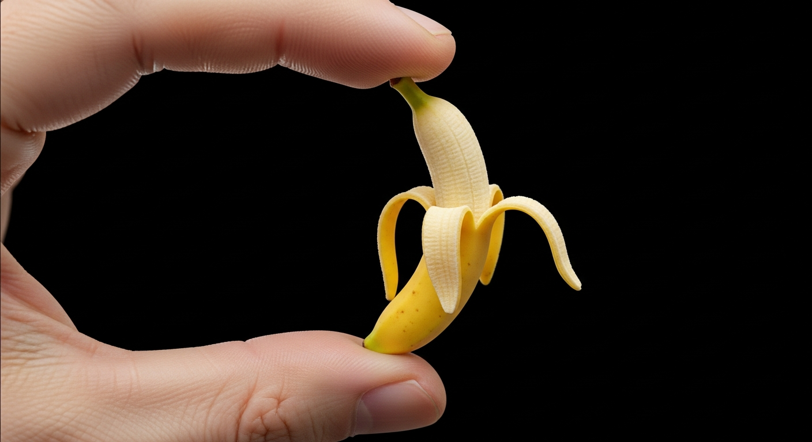

# Modeles de generation d'image Google — Inventaire

Reference des modeles disponibles via le SDK `google-genai` (avril 2026).

Les alias "Nano Banana" viennent du surnom de Naina Raisinghani (PM DeepMind), popularise lors des tests anonymes sur [Arena](https://lmarena.ai/) en aout 2025.

## Famille Gemini — API `generate_content`

Modeles multimodaux : acceptent texte + image en entree, produisent texte + image en sortie. Supportent l'edition d'images existantes.

| Modele | Alias | Resolution | Vitesse | Prix | Exemple "nano banana" |
|--------|-------|-----------|---------|------|-----------------------|
| `gemini-2.5-flash-image` | Nano Banana | 1K | ~3s | $0.039/img |  |
| `gemini-3-pro-image-preview` | Nano Banana Pro | 1K / 2K / 4K | ~8-12s | $0.134/img |  |
| `gemini-3.1-flash-image-preview` | Nano Banana 2 | jusqu'a 4K | ~4-6s | ~$0.03/img |  |

### Details des modeles Gemini

**Nano Banana** (`gemini-2.5-flash-image`) — Aout 2025
- Le plus rapide et le moins cher
- Precision du texte dans l'image ~80%
- Ideal pour les iterations rapides et le volume eleve

**Nano Banana Pro** (`gemini-3-pro-image-preview`) — Novembre 2025
- Haute resolution jusqu'a 4K (1K, 2K, 4K)
- Precision du texte dans l'image ~94%
- Controles avances : lighting, focus, camera, edits localises
- Coherence du sujet entre images multiples
- Support Google Search (infos temps reel dans l'image)
- Aspect ratios : 1:1, 2:3, 3:2, 3:4, 4:3, 4:5, 5:4, 9:16, 16:9, 21:9

**Nano Banana 2** (`gemini-3.1-flash-image-preview`) — Fevrier 2026
- Successeur de Nano Banana, plus rapide avec meilleure qualite
- Meilleur suivi d'instructions et rendu du texte
- Integre dans Gemini app, Search AI Mode, Lens

---

## Famille Imagen — API `generate_images`

Modeles text-to-image purs. API plus simple, pas de multimodal.

| Modele | Alias | Resolution | Prix | Exemple "nano banana" |
|--------|-------|-----------|------|-----------------------|
| `imagen-4.0-fast-generate-001` | Imagen 4 Fast | standard | $0.02/img |  |
| `imagen-4.0-generate-001` | Imagen 4 | jusqu'a 2K | $0.04/img |  |
| `imagen-4.0-generate-001` (16:9) | Imagen 4 | jusqu'a 2K | $0.04/img |  |
| `imagen-4.0-ultra-generate-001` | Imagen 4 Ultra | jusqu'a 2K | $0.06/img |  |

### Details des modeles Imagen

**Imagen 4 Fast** (`imagen-4.0-fast-generate-001`) — Fevrier 2026
- Le moins cher de toute la gamme ($0.02)
- Ideal pour le volume et les previews

**Imagen 4** (`imagen-4.0-generate-001`) — Fevrier 2026
- Bon rapport qualite/prix
- Typographie amelioree (posters, invitations)
- SynthID watermarking
- Supporte les aspect ratios (16:9, etc.)

**Imagen 4 Ultra** (`imagen-4.0-ultra-generate-001`) — Fevrier 2026
- Meilleure qualite de la famille Imagen
- Typographie optimale
- SynthID watermarking

---

## Modeles deprecies

| Modele | Statut | Remplace par |
|--------|--------|-------------|
| `gemini-2.0-flash-preview-image-generation` | Supprime (404) | `gemini-2.5-flash-image` |
| `imagen-3.0-generate-002` | Ancien | `imagen-4.0-generate-001` |

---

## Utilisation dans le projet

Le script `scripts/linkedin_post.py` utilise `gemini-3-pro-image-preview` (Nano Banana Pro) pour generer les images editoriales LinkedIn.

Le script `scripts/test_image.py` teste les 7 modeles ci-dessus. Usage :

```bash
python scripts/test_image.py                    # prompt depuis .pipeline/linkedin/image_prompt.txt
python scripts/test_image.py "a cute robot"     # prompt custom
```

Configuration complete : `config/image-models.yaml`

## Sources

- [Nano Banana 2 — Google Blog](https://blog.google/innovation-and-ai/technology/ai/nano-banana-2/)
- [Gemini Image — Google DeepMind](https://deepmind.google/models/gemini-image/)
- [Nano Banana Pro — Google DeepMind](https://deepmind.google/models/gemini-image/pro/)
- [Imagen 4 — Google Developers Blog](https://developers.googleblog.com/announcing-imagen-4-fast-and-imagen-4-family-generally-available-in-the-gemini-api/)
- [Image generation docs — Google AI for Developers](https://ai.google.dev/gemini-api/docs/image-generation)
- [Google GenAI Python SDK](https://github.com/googleapis/python-genai)
