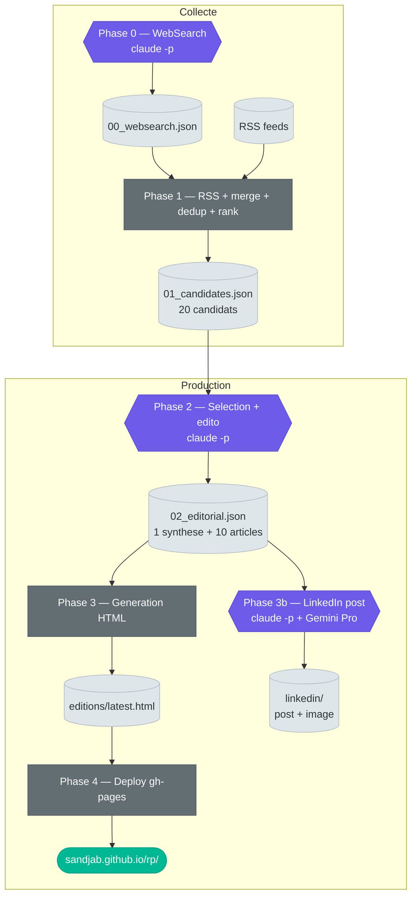

# IA qu'à demander

Revue de presse quotidienne automatisee — tech, IA & sciences. Pipeline qui collecte, redige et publie une edition interactive sur GitHub Pages.

**[Voir le site live](https://sandjab.github.io/rp/)**

## Pipeline



**Legende** : hexagones violets = LLM (`claude -p`) · rectangles gris = scripts Python · documents clairs = artefacts `.pipeline/`

## Installation

```bash
uv venv && source .venv/bin/activate
uv pip install -r requirements.txt
```

Prerequis :
- Python 3.11+
- [uv](https://docs.astral.sh/uv/) (`curl -LsSf https://astral.sh/uv/install.sh | sh`)
- `claude` CLI (pour les phases LLM)
- `GOOGLE_API_KEY` dans l'environnement (pour la generation d'images LinkedIn)

## Lancer une edition

```bash
bash scripts/run_edition.sh
```

Sans deploiement (test local) :

```bash
bash scripts/run_edition.sh --no-deploy
```

Sans deploy ni LinkedIn :

```bash
bash scripts/run_edition.sh --no-deploy --no-linkedin
```

### Iterer sur le style editorial

Le script `iterate_editorials.sh` collecte une seule fois, puis genere plusieurs variantes editoriales (styles differents) a comparer avant de publier :

```bash
# Collecter + generer 3 variantes (deep, angle, focused), choisir, publier
bash scripts/iterate_editorials.sh --tomorrow

# Sans deploy ni LinkedIn (iteration locale)
bash scripts/iterate_editorials.sh --tomorrow --no-deploy --no-linkedin

# Regener une seule variante sans recolleter
bash scripts/iterate_editorials.sh --skip-collect --styles=deep
```

Le script affiche un resume comparatif (titre, extrait, articles) puis demande interactivement quelle variante retenir avant de generer le HTML.

### Iterer avec run_edition.sh

Approche alternative : generer plusieurs editions completes, comparer, puis deployer la meilleure :

```bash
# 1. Generer plusieurs editions sans deployer ni LinkedIn
bash scripts/run_edition.sh --no-deploy --no-linkedin
bash scripts/run_edition.sh --no-deploy --no-linkedin
bash scripts/run_edition.sh --no-deploy --no-linkedin

# 2. Comparer les HTML dans editions/archives/
#    Garder celui qui plait, supprimer les autres

# 3. Generer le LinkedIn pour l'edition choisie
python3 scripts/linkedin_post.py --editorial editions/archives/editorial.{timestamp}.json

# 4. Deployer
python3 scripts/deploy.py
```

`deploy.py` selectionne automatiquement l'archive HTML la plus recente par date et reconstruit le manifest a partir du snapshot correspondant. Supprimer les archives non retenues suffit pour orienter le deploy.

## Structure

```
config/
  revue-presse.yaml    # Config globale (topics, queries, styling)
  rss-feeds.yaml       # Flux RSS
scripts/
  run_edition.sh       # Orchestrateur (5 phases)
  iterate_editorials.sh # Multi-variantes editoriales
  websearch_collect.py # Phase 0 : WebSearch via claude -p
  collect.py           # Phase 1 : RSS + merge + dedup + rank
  write_editorial.py   # Phase 2 : selection + edito via claude -p
  generate_edition.py  # Phase 3 : generation HTML
  linkedin_post.py     # Phase 3b : post LinkedIn via claude -p + Gemini Pro
  deploy.py            # Phase 4 : push gh-pages
  validate.py          # Validation JSON inter-phases
  prompts/             # Prompts pour claude -p
    linkedin.md        # Prompt pour le post LinkedIn
templates/
  edition.html         # Template HTML (CSS + JS inline)
editions/              # HTML generes
  archives/
    manifest.json      # Metadonnees des editions (date, numero, titre)
.pipeline/             # Artefacts intermediaires (gitignore)
  linkedin/            # Post LinkedIn (post.txt, comment.txt, image.png)
requirements.txt       # Dependances Python
```

## Scripts

### `run_edition.sh` — Orchestrateur

Lance les 5 phases sequentiellement. Recree `.pipeline/` a chaque run. Les Phases 0 et 3b sont tolerantes : si elles echouent, le pipeline continue.

| Parametre | Default | Description |
|-----------|---------|-------------|
| `--no-deploy` | deploy actif | Saute la Phase 4 (deploy gh-pages) |
| `--no-linkedin` | LinkedIn actif | Saute la Phase 3b (post LinkedIn) |
| `--tomorrow` | date du jour | Date d'edition = J+1 (propage `RP_EDITION_DATE`) |
| `--date=YYYY-MM-DD` | date du jour | Force la date d'edition (propage `RP_EDITION_DATE`) |
| `--edito-style=<style>` | `focused` | Style editorial : `focused`, `angle`, `deep` (propage `EDITO_STYLE`) |
| `--prompt-version=<v>` | `v1` | Version du prompt : `v1`, `v2` (propage `PROMPT_VERSION`) |

### `iterate_editorials.sh` — Multi-variantes editoriales

Collecte une fois (Phases 0+1), puis genere N variantes editoriales (Phase 2) avec des styles differents. Affiche un resume comparatif, demande un choix interactif, puis genere le HTML (Phase 3) + LinkedIn et deploy optionnels.

| Parametre | Default | Description |
|-----------|---------|-------------|
| `--styles=s1,s2,...` | `deep,angle,focused` | Styles a generer (separes par des virgules) |
| `--skip-collect` | collecte active | Reutilise `.pipeline/01_candidates.json` existant |
| `--tomorrow` | date du jour | Date d'edition = J+1 (propage `RP_EDITION_DATE`) |
| `--date=YYYY-MM-DD` | date du jour | Force la date d'edition |
| `--prompt-version=<v>` | config | Version du prompt : `v1`, `v2` |
| `--no-linkedin` | LinkedIn actif | Saute la Phase 3b |
| `--no-deploy` | deploy actif | Saute la Phase 4 |

Les variantes sont sauvegardees dans `.pipeline/variants/editorial_{style}.json`.

### `websearch_collect.py` — Phase 0 : recherche web

Appelle `claude -p` avec l'outil WebSearch pour trouver des articles recents. Construit les requetes depuis les topics de `revue-presse.yaml`, remplit le prompt `prompts/websearch.md`, extrait le JSON de la reponse. Ecrit `.pipeline/00_websearch.json` (tableau vide si echec). Sauvegarde la reponse brute pour debug.

Pas de parametres CLI. Lit `RP_EDITION_DATE` pour la date injectee dans le prompt.

### `collect.py` — Phase 1 : collecte + tri

Orchestre les sous-scripts. Enchaine : RSS → merge WebSearch → dedup → filtre IA → ranking top 20. Communique avec les sous-scripts via JSON stdin/stdout. Ecrit `.pipeline/01_candidates.json`.

Pas de parametres CLI.

| Variable d'env | Default | Description |
|----------------|---------|-------------|
| `RP_EDITION_DATE` | date du jour | Exclut les editions de cette date du dedup historique |
| `RP_MAX_CANDIDATES` | `25` | Nombre max de candidats passes au ranker |

### `parse_rss.py` — Flux RSS

Charge les feeds depuis `rss-feeds.yaml`, parse chaque flux avec `feedparser` (timeout 10s), filtre les articles de +48h, nettoie le HTML des resumes (max 500 chars), attache le score d'autorite de la source. Renvoie le JSON sur stdout.

Pas de parametres.

### `deduplicate.py` — Deduplication

Elimine les doublons par URL normalisee et par similarite de titre (`SequenceMatcher`). Trie par autorite decroissante pour garder la meilleure source. Seuils : 0.75 pour meme domaine, 0.85 en cross-domaine.

Pas de parametres. Lit JSON sur stdin, ecrit sur stdout.

### `rank_articles.py` — Scoring

Score chaque article sur 80 points max :
- **Recency** (0-30) : bonus decroissant selon l'age (<3h, <6h, <12h, <24h, <48h)
- **Authority** (0-25) : depuis `source_authority` du config
- **Depth** (0-15) : bonus si `research_context` ou resume long
- **Breaking** (0-10) : heuristique sur mots-cles ("launches", "breaking"...)

Lit JSON sur stdin, ecrit sur stdout.

| Variable d'env | Default | Description |
|----------------|---------|-------------|
| `RP_MAX_CANDIDATES` | `config.edition.max_articles` ou `15` | Nombre d'articles retournes |

### `write_editorial.py` — Phase 2 : redaction

Appelle `claude -p` avec le prompt `prompts/editorial.md` et les 20 candidats. Le LLM selectionne 8 articles, ecrit un titre editorial + resume en francais pour chacun, plus une synthese globale. Max 2 tentatives avec feedback d'erreur au retry. Ecrit `.pipeline/02_editorial.json`.

Pas de parametres CLI. Lit JSON sur stdin.

| Variable d'env | Default | Description |
|----------------|---------|-------------|
| `RP_EDITION_DATE` | date du jour UTC | Date injectee dans le prompt (`{{DATE}}`) |
| `EDITO_STYLE` | `config.edition.edito_style` ou `focused` | Style editorial (`focused`, `angle`, `deep`) |
| `PROMPT_VERSION` | `config.edition.prompt_version` ou `v1` | Version du prompt (`v1`, `v2`) |

### `generate_edition.py` — Phase 3 : HTML

Remplit le template `templates/edition.html` avec les articles editorialises. Genere les cards pour le carrousel desktop et la grille mobile, les timestamps relatifs en francais ("il y a 2h"), le numero d'edition. Produit `latest.html` pour le deploy et une copie archivee horodatee dans `editions/archives/`. Met a jour `editions/archives/manifest.json` avec les metadonnees de l'edition (date, numero, titre editorial).

| Parametre | Default | Description |
|-----------|---------|-------------|
| `input` (positional, optionnel) | stdin | Fichier JSON editorial |
| `-h`, `--help` | — | Affiche l'aide |

Lit `RP_EDITION_DATE` pour la date d'edition affichee et le calcul du numero.

### `linkedin_post.py` — Phase 3b : post LinkedIn

Genere un post LinkedIn optimise a partir de l'edition du jour. Appelle `claude -p` avec le prompt `prompts/linkedin.md` pour produire un texte adapte au format LinkedIn (hook ≤210 chars, corps 800-1200 chars, CTA subtil). Genere une image editoriale via Gemini Pro (SDK `google-genai`), puis superpose le titre et sous-titre via Pillow pour un rendu typographique parfait. Ecrit `.pipeline/linkedin/post.txt`, `comment.txt`, `image.png`. Copie le post dans le presse-papier. Tolerant : si l'image ou le post echouent, le pipeline continue.

| Parametre | Default | Description |
|-----------|---------|-------------|
| `--editorial <path>` | `.pipeline/02_editorial.json` | Fichier JSON editorial |
| `--image-only` | desactive | Regenere uniquement l'image (reutilise `image_prompt.txt` existant) |

| Variable d'env | Default | Description |
|----------------|---------|-------------|
| `GOOGLE_API_KEY` | — | Cle API Gemini pour la generation d'image (skip si absent) |
| `RP_EDITION_DATE` | date du jour | Override de la date pour le numero d'edition |

### `deploy.py` — Phase 4 : publication

Clone la branche `gh-pages` en shallow, copie `latest.html` comme `index.html`, nettoie les editions residuelles dans `editions/` et copie les archives dans `editions/archives/`. Genere `editions/archives/index.html` depuis `manifest.json` avec numero, titre editorial et date pour chaque edition. Commit et push vers GitHub Pages.

Pas de parametres. Configuration lue depuis `config/revue-presse.yaml`.

### `validate.py` — Validation inter-phases

Verifie la structure JSON entre les phases. Pour les candidats : tableau, ≥5 articles, champs `title`/`url`/`source`. Pour l'editorial : synthese en position 0, champs `editorial_title`/`editorial_summary`/`url`.

```
python3 scripts/validate.py <fichier.json> --phase <candidates|editorial>
```

### `billet_humeur.py` — Billet d'humeur

Genere un billet d'humeur editorial a partir d'un fichier HTML (edition ou article).

| Parametre | Default | Description |
|-----------|---------|-------------|
| `html_file` (positional, requis) | — | Chemin vers un fichier HTML |
| `--style <style>` | `focused` | Style editorial : `focused`, `angle`, `deep` |
| `-o`, `--output <path>` | `.pipeline/billet.txt` | Fichier de sortie (`"-"` pour stdout) |
| `--prompt-version <v>` | `v1` | Version du prompt : `v1`, `v2` |

## Variables d'environnement

Recapitulatif des variables propagees par `run_edition.sh` ou utilisables en appel direct :

| Variable | Default | Scripts concernes | Description |
|----------|---------|-------------------|-------------|
| `RP_EDITION_DATE` | date du jour | tous sauf `parse_rss`, `deduplicate`, `deploy` | Force la date d'edition (`YYYY-MM-DD`) |
| `RP_MAX_CANDIDATES` | `25` | `collect.py`, `rank_articles.py` | Nombre max de candidats |
| `EDITO_STYLE` | `focused` | `write_editorial.py`, `billet_humeur.py` | Style editorial (`focused`/`angle`/`deep`) |
| `PROMPT_VERSION` | `v1` | `write_editorial.py`, `billet_humeur.py` | Version du prompt (`v1`/`v2`) |
| `GOOGLE_API_KEY` | — | `linkedin_post.py` | Cle API Gemini pour generation d'image |

## Stack

- **Python** — collecte RSS, dedup, ranking, generation HTML, deploy
- **Claude Opus via `claude -p`** — recherche web, selection editoriale, redaction
- **Templating HTML** — template unique avec CSS + JS inline
- **GitHub Pages** — hebergement statique via branche `gh-pages`
- **Gemini Pro via `google-genai`** — generation d'images editoriales
- **uv** — gestion de l'environnement virtuel Python
