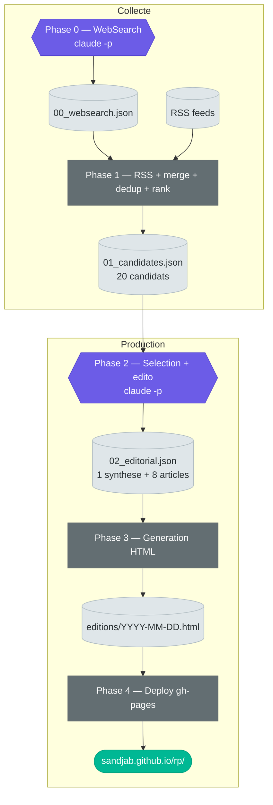

# IA qu'à demander

Revue de presse quotidienne automatisee — tech, IA & sciences. Pipeline qui collecte, redige et publie une edition interactive sur GitHub Pages.

**[Voir le site live](https://sandjab.github.io/rp/)**

## Pipeline



**Legende** : hexagones violets = LLM (`claude -p`) · rectangles gris = scripts Python · documents clairs = artefacts `.pipeline/`

## Lancer une edition

```bash
bash scripts/run_edition.sh
```

Sans deploiement (test local) :

```bash
bash scripts/run_edition.sh --no-deploy
```

## Structure

```
config/
  revue-presse.yaml    # Config globale (topics, queries, styling)
  rss-feeds.yaml       # Flux RSS
scripts/
  run_edition.sh       # Orchestrateur (5 phases)
  websearch_collect.py # Phase 0 : WebSearch via claude -p
  collect.py           # Phase 1 : RSS + merge + dedup + rank
  write_editorial.py   # Phase 2 : selection + edito via claude -p
  generate_edition.py  # Phase 3 : generation HTML
  deploy.py            # Phase 4 : push gh-pages
  validate.py          # Validation JSON inter-phases
  prompts/             # Prompts pour claude -p
templates/
  edition.html         # Template HTML (CSS + JS inline)
editions/              # HTML generes
  archives/
    manifest.json      # Metadonnees des editions (date, numero, titre)
.pipeline/             # Artefacts intermediaires (gitignore)
```

## Scripts

### `run_edition.sh` — Orchestrateur

Lance les 5 phases sequentiellement. Accepte `--no-deploy` pour sauter le deploiement. Recree `.pipeline/` a chaque run. La Phase 0 est tolerante : si elle echoue, le pipeline continue avec les RSS seuls.

### `websearch_collect.py` — Phase 0 : recherche web

Appelle `claude -p` avec l'outil WebSearch pour trouver des articles recents. Construit les requetes depuis les topics de `revue-presse.yaml`, remplit le prompt `prompts/websearch.md`, extrait le JSON de la reponse. Ecrit `.pipeline/00_websearch.json` (tableau vide si echec). Sauvegarde la reponse brute pour debug.

### `collect.py` — Phase 1 : collecte + tri

Orchestre les sous-scripts. Enchaine : RSS → merge WebSearch → dedup → filtre IA → ranking top 20. Communique avec les sous-scripts via JSON stdin/stdout. Ecrit `.pipeline/01_candidates.json`.

### `parse_rss.py` — Flux RSS

Charge les feeds depuis `rss-feeds.yaml`, parse chaque flux avec `feedparser` (timeout 10s), filtre les articles de +48h, nettoie le HTML des resumes (max 500 chars), attache le score d'autorite de la source. Renvoie le JSON sur stdout.

### `deduplicate.py` — Deduplication

Elimine les doublons par URL normalisee et par similarite de titre (`SequenceMatcher`). Trie par autorite decroissante pour garder la meilleure source. Seuils : 0.75 pour meme domaine, 0.85 en cross-domaine.

### `rank_articles.py` — Scoring

Score chaque article sur 80 points max :
- **Recency** (0-30) : bonus decroissant selon l'age (<3h, <6h, <12h, <24h, <48h)
- **Authority** (0-25) : depuis `source_authority` du config
- **Depth** (0-15) : bonus si `research_context` ou resume long
- **Breaking** (0-10) : heuristique sur mots-cles ("launches", "breaking"...)

Retourne le top N (`RP_MAX_CANDIDATES`, defaut 20).

### `write_editorial.py` — Phase 2 : redaction

Appelle `claude -p` avec le prompt `prompts/editorial.md` et les 20 candidats. Le LLM selectionne 8 articles, ecrit un titre editorial + resume en francais pour chacun, plus une synthese globale. Max 2 tentatives avec feedback d'erreur au retry. Ecrit `.pipeline/02_editorial.json`.

### `generate_edition.py` — Phase 3 : HTML

Remplit le template `templates/edition.html` avec les articles editorialises. Genere les cards pour le carrousel desktop et la grille mobile, les timestamps relatifs en francais ("il y a 2h"), le numero d'edition. Produit l'edition datee, une copie archivee horodatee, et `latest.html` pour le deploy. Met a jour `editions/archives/manifest.json` avec les metadonnees de l'edition (date, numero, titre editorial).

### `deploy.py` — Phase 4 : publication

Clone la branche `gh-pages` en shallow, copie `latest.html` comme `index.html`, ajoute l'edition datee et les archives. Genere `editions/archives/index.html` depuis `manifest.json` avec numero, titre editorial et date pour chaque edition. Commit et push vers GitHub Pages.

### `validate.py` — Validation inter-phases

Verifie la structure JSON entre les phases. Pour les candidats : tableau, ≥5 articles, champs `title`/`url`/`source`. Pour l'editorial : synthese en position 0, champs `editorial_title`/`editorial_summary`/`url`.

## Stack

- **Python** — collecte RSS, dedup, ranking, generation HTML, deploy
- **Claude Opus via `claude -p`** — recherche web, selection editoriale, redaction
- **Templating HTML** — template unique avec CSS + JS inline
- **GitHub Pages** — hebergement statique via branche `gh-pages`
